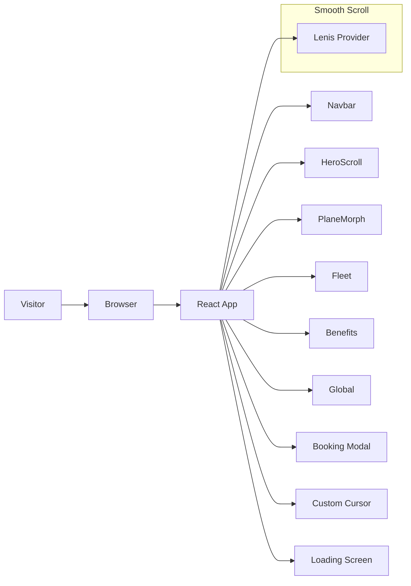

# Jesko Jets ✈️


> A cinematic private jet charter landing page built with modern React, TypeScript, and Tailwind CSS. Designed to feel premium, responsive, and polished for aviation brands.

## 🚀 Project Overview

Jesko Jets is a sleek landing page concept for a luxury private aviation brand. It showcases immersive motion, smooth scrolling, refined typography, and interactive booking UI patterns. The codebase is optimized for:

- Modern developer experience with **Vite + TypeScript**
- Pixel-perfect styling using **Tailwind CSS**
- Fluid animation via **Framer Motion**
- Smooth scrolling and cinematic motion using **Lenis**
- Reusable and accessible UI components

## ✨ Key Features

- Responsive landing page layout with hero, fleet, benefits, and global reach sections
- Animated plane morph and scroll-driven interactions
- Custom cursor and polished loading experience
- Booking modal with clean UI patterns
- Modular component structure for easy extension
- SEO-ready meta configuration and premium typography

## 🧩 Tech Stack

| Layer | Technology |
|---|---|
| Build Tool | Vite |
| Language | TypeScript |
| Framework | React |
| Styling | Tailwind CSS |
| Motion | Framer Motion |
| Scrolling | @studio-freight/lenis |
| Utilities | clsx, tailwind-merge |

## 📁 Project Structure

```text
/src
  /components
    /layout
      Navbar.tsx
    /sections
      About.tsx
      Benefits.tsx
      Fleet.tsx
      Global.tsx
      GlobeFooter.tsx
      HeroScroll.tsx
      PlaneMorph.tsx
    /ui
      BookingModal.tsx
      CustomCursor.tsx
      LoadingScreen.tsx
      Marquee.tsx
      SectionDivider.tsx
  /hooks
    useImagePreloader.ts
    useLenis.tsx
    useScrollProgress.tsx
  /lib
    utils.ts
  App.tsx
  main.tsx
  index.css
/index.html
/package.json
/vite.config.ts
/tailwind.config.ts
```

## 🧠 Architecture Diagram



## ⚙️ Getting Started

### Prerequisites

- Node.js 18+ recommended
- npm or Yarn installed

### Install Dependencies

```bash
npm install
```

### Run in Development

```bash
npm run dev
```

Open the local Vite server URL shown in the terminal to preview the website.

### Build for Production

```bash
npm run build
```

### Preview Production Build

```bash
npm run preview
```

## 🔧 Scripts

| Script | Description |
|---|---|
| `npm run dev` | Start local development server |
| `npm run build` | Compile TypeScript and build production output |
| `npm run preview` | Preview the production build locally |

## 📌 Customization Guide

### Styling

- Tailwind theme and custom colors are configured in `tailwind.config.ts`
- Update `index.css` to adjust base styles and typography
- Brand colors live under the `extend.colors` section

### Content

- Hero and landing content is composed inside `src/App.tsx` and section components
- Update text, images, and calls to action directly in the section files

### Motion and UX

- `src/hooks/useLenis.tsx` controls smooth scrolling behavior
- Animated components are built with `framer-motion`
- The booking modal is implemented in `src/components/ui/BookingModal.tsx`

## 🛠️ Contribution Guide

Thank you for considering contributions! Jesko Jets is structured to be easy to extend.

1. Fork the repository
2. Create a branch: `git checkout -b feature/your-feature`
3. Install dependencies: `npm install`
4. Make your changes
5. Submit a pull request with a clear description

> Tip: Keep contributions small and focused. Update existing components or add new sections with reusable hooks and UI patterns.

## 💡 Helpful Tips

- Use `clsx` and `tailwind-merge` together to manage conditional class names cleanly
- Keep animations subtle for a luxury brand feel
- Use responsive design utilities in Tailwind to preserve mobile-first layout
- Isolate new UI sections into `src/components/sections` for maintainability

## 📚 Recommended Improvements

- Add a real backend or booking engine for production usage
- Include image optimization for better performance
- Add accessibility enhancements such as keyboard navigation and ARIA labels
- Add a license file if this project becomes open source

## 📄 Notes

This repository is a polished front-end prototype ideal for luxury travel, aviation, or premium brand landing pages. It is built to be easy to read, extend, and customize for both experienced developers and beginners.

---

Created with a focus on modern app architecture, premium UX, and clean open-source presentation.
